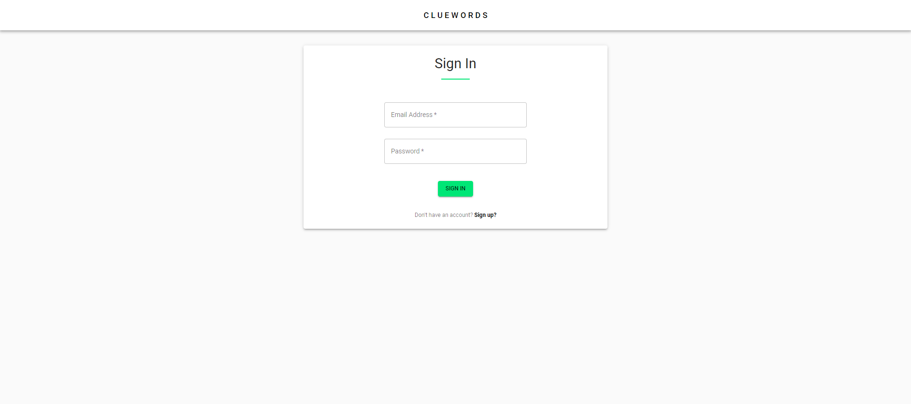

# Team Iron Man: ClueWords <!-- omit in toc -->

**_Table of Contents:_**

- [Preview](#preview)
- [About](#about)
- [Authors](#authors)
- [Setup Guide](#setup-guide)
  - [Prerequisites](#prerequisites)
  - [Getting Started](#getting-started)

# Preview

This project is currently live at ___________



# About

Cluewords: An online multiplayer game with at least 4 players. Players are divided in two teams, blue and red. Each team is further divided into SpyMaster and Operatives. Operatives have to guess correct cards based on clues provided by the SpyMaster. First team to guess all the correct cards wins

**Tech Stack**

MERN (Mongo, Express, React, Node)

|      Other Highlights       |
| :-------------------------: |
|         material-ui         |
|          socket.io          |

# Authors

Built by [Umer](https://github.com/uzher-code), [Chris](https://github.com/CSimbulan), and [Tony](https://github.com/rsun45)

# Setup Guide

## Prerequisites

In order to run this project locally you **must** have [node.js](https://nodejs.org/en/) installed.

This project was built on the following node version.

```bash
$ node --version
v14.16.0
```

You must also create a `.env` file in `./server` with the following variables:

```bash
# randomly generated
SECRET_KEY=" "

# obtained from mongoDB
MONGODB_ATLAS_URI=" "
```

One more `.env` file needs to be created in `./client`

```bash

# obtained from cloudinary
REACT_APP_CLOUDINARY_CLOUD_NAME=" "
REACT_APP_CLOUDINARY_UPLOAD_PRESET=" "

```
If any of the above environment variables are missing the project will loose some functionality or even fail to run.

## Getting Started

```bash
git clone https://github.com/hatchways/team-iron-man.git
```

For client-side/frontend
```bash
cd ./client
```

```bash
npm install
```

```bash
npm start
```

For server-side/backend
```bash
cd ./client
```

```bash
npm install
```

```bash
npm run dev
```